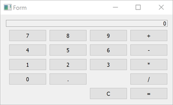

# QT--QWeight--Quick(QML)
### 1.logistics_storage project
use QT  filestream  read-write data operation.

use QT  sqlite store operation.

 登录界面login-signin

信息提示-登录失败login-signup

功能界面functional interface

 

### 2.calculator QT(QML)
use qweight

 calculator effect picture

